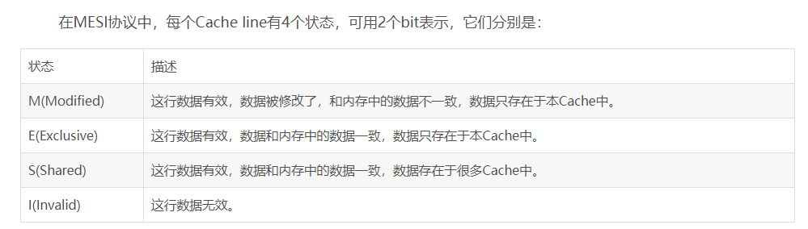
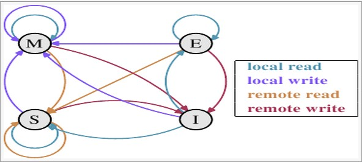

### JDK-Concurrent 深入学习
- 开始从源码层面研究Concurrent包,以及其他并发相关的包,对于途中遇到的不明白的东西,也会作相应了解.
- 该项目的缘由是看CopyOnWriteArrayList源码时,对Unsafe类一无所知,才有了好好钻研一番的冲动.
- AtomicLong在高并发下性能甚至还不如加锁,LongAdder比AtomicLong更适用于高并发下的累加 TODO 后续研究其原理
#### 强引用、软引用、弱引用、幽灵引用、引用队列
- 强引用:StrongReference
    - 例如Date date = new Date()；对象可以在程序中到处传递；
    - 强引用限制了对象在内存中的存活时间；例如A对象中保存了B对象的强引用，那么如果
        A对象没有把B对象设为null的话，只有当A对象被回收后，B对象不再指向它了，才可能被回收.
    ```
        // java.lang.OutOfMemoryError: GC overhead limit exceeded
        // 内存溢出，因为引用之一直存在，不会被GC
        ArrayList<Object> list = new ArrayList<>();
        for (;;){
            HashMap<Object, Object> ma = new HashMap<>();
            ma.put("xxxxxxxxxxxxxxxxxxxxxxxxxxxxxxxxxxxxxxxxxxxxxxxxxxxxxxxxxxxxxxxxxxxxxxxxxxxxx", new Double(100000000));
            list.add(ma);
        }
    ```
- 软引用:SoftReference
    - 当JVM内存不足时，可以回收软引用对象，如果还不足才抛出OOM(OutOfMemory)；
    - 该引用非常适合创建缓存；
    - 注意，因为该对象可能被回收，所以每次get时，需要判断是否存在
    - 在JDK 1.2之后，提供了SoftReference类来实现软引用。
    ```
        // java.lang.NullPointerException
        // 最后抛出空指针，因为当jvm内存不足，该引用被GC,则get()方法获取到null
        SoftReference<ArrayList<Object>> s = new SoftReference<>( new ArrayList<>());
        for (;;){
            HashMap<Object, Object> ma = new HashMap<>();
            ma.put("xxxxxxxxxxxxxxxxxxxxxxxxxxxxxxxxxxxxxxxxxxxxxxxxxxxxxxxxxxxxxxxxxxxxxxxxxxxxx", new Double(100000000));
            s.get().add(ma);
        }
    ```    
- 弱引用:WeakReference
    - 引用一个对象，但是并不阻止该对象被回收
    - 在垃圾回收器运行的时候，如果一个对象的所有引用都是弱引用的话，该对象会被回收
    - 弱引用的作用在于解决强引用所带来的对象之间在存活时间上的耦合关系
    - 常用于集合类，例如HashMap中(有WeakHashMap类)；
    - 在JDK 1.2之后，提供了WeakReference类来实现弱引用。
    - (如下类加载器中的并发类加载器注册逻辑就使用了该引用,以在类加载器GC后,自动GC该类加载器的是否并发状态)  
    ```
        /**
         * 弱引用
         * java.lang.NullPointerException
         * 当map不再有对list的强引用时，list就会被gc，就会报空指针
         * 此处模拟，执行循环1000次后，将map=null，然后下次GC，list就会马上被回收
         * 注意，如果不在后面再次调用map，jvm应当会在map指定完map.put("a", new ArrayList<>());后，就可能将其GC
         */
        // 构造一个list放入map -此处map维护了对list的强引用
        Map<Object, List<Object>> map = new HashMap();
        map.put("a", new ArrayList<>());
        // 将该list放入弱引用对象中
        WeakReference<List<Object>> s = new WeakReference<>(map.get("a"));
        int i = 0;
        for (; ; i++) {
            // 将map设置为null，也就是去除了所有对list的强引用，只剩下一个对list的弱引用
            if (i > 1000) {
                  map = null;
            }
            HashMap<Object, Object> ma = new HashMap<>();
            ma.put("xxxxxxxxxxxxxxxxxxxxxxxxxxxxxxxxxxxxxxxxxxxxxxxxxxxxxxxxxxxxxxxxxxxxxxxxxxxxx", new Double(100000000));
            try {
                s.get().add(ma);
            } catch (Exception e) {
                // 结束时输出此时的i
                System.out.println(i);
                // 如果不增加下面这句代码，再次使用到map。 map在执行完map.put("a", new ArrayList<>());后就会被回收
                // 所以即使没有执行map = null;，很快也会报空指针。
                System.out.println(map.get("a"));
                System.out.println(e.getMessage());
                break;
            }
        }
    ```
- 幽灵引用:PhantomReference
    - 任何时候调用get，返回的都是null，需要搭配引用队列使用
    - PhantomReference ref = new PhantomReference(new A(), queue); 这么写可以确保A对象完全被回收后才进入引用队列
    - 在创建幽灵引用PhantomReference的时候必须要指定一个引用队列。  
        当一个对象的finalize方法已经被调用了之后，这个对象的幽灵引用会被加入到队列中。  
        通过检查该队列里面的内容就知道一个对象是不是已经准备要被回收了。  
    - 幽灵引用及其队列的使用情况并不多见，主要用来实现比较精细的内存使用控制，这对于移动设备来说是很有意义的。
        程序可以在确定一个对象要被回收之后，再申请内存创建新的对象。通过这种方式可以使得程序所消耗的内存维持在一个相对较低的数量
    - 在JDK 1.2之后，提供了PhantomReference类来实现幽灵引用。
- 引用队列:ReferenceQueue
    - 在有些情况下，程序会需要在一个对象的可达到性发生变化的时候得到通知。  
    比如某个对象的强引用都已经不存在了，只剩下软引用或是弱引用。但是还需要对引用本身做一些的处理。  
    典型的情景是在哈希表中。引用对象是作为WeakHashMap中的键对象的，当其引用的实际对象被垃圾回收之后，  
    就需要把该键值对从哈希表中删除。有了引用队列（ReferenceQueue），就可以方便的获取到这些弱引用对象，  
    将它们从表中删除。在软引用和弱引用对象被添加到队列之前，其对实际对象的引用会被自动清空。  
    通过引用队列的poll/remove方法就可以分别以非阻塞和阻塞的方式获取队列中的引用对象。
    ```
        /**
         * 幽灵引用&引用队列
         */
        // 引用队列
        ReferenceQueue<List<Object>> q = new ReferenceQueue<>();
        new Thread(()->{
            try {
                // 此处remove()方法是阻塞的，直到获取到一个被GC的对象，就会输出
                System.out.println(q.remove());
            }catch (Exception e){
                e.printStackTrace();
            }
        }).start();
        // 幽灵引用
        PhantomReference<List<Object>> p = new PhantomReference<>(new ArrayList<>(),q);
        // null
        System.out.println(p.get());
        // 主动执行gc，执行完毕后，队列将收到通知
        System.gc();
    ```

#### 双亲委派模型
- 对于JVM来说,只有两种类加载器
    - 启动类加载器(Bootstrap ClassLoader): 由C++语言实现（针对HotSpot）,负责将存放在<JAVA_HOME>\lib目录或-Xbootclasspath参数指定的路径中的类库加载到内存中（比如rt.jar）
    - 其他类加载器: 由Java实现,并继承java.lang.ClassLoader.
- 或者更细分为
    - 启动类加载器(Bootstrap ClassLoader)
    - 扩展类加载器(Extension ClassLoader): 负责加载%JAVA_HOME%/lib/ext中的所有类库,由 Sun 的 ExtClassLoader（sun.misc.Launcher$ExtClassLoader）实现
    - 应用程序加载器(Application ClassLoader): 负责加载classpath中的所有类库.由 Sun 的 AppClassLoader（sun.misc.Launcher$AppClassLoader）实现
        由于该类加载器是ClassLoader中的getSystemClassLoader()方法的返回值，因此被称为系统（System）加载器。
- 双亲委派模型:
    - 该模型要求除了BootstrapClassLoader外,其余的类加载器都需要有自己的父类加载器.
    - 子类加载器通过组合(<Java编程思想>中提及过,也就是子类加载器将父类加载器作为自己的成员变量)而非继承复用父类加载器的代码.
    - 在某个类加载器加载class文件时,它首先通过父类加载器去加载(这样依次传递到顶层类加载器(BootstrapClassLoader)),如果父类加载器加载不了(它的搜索范围中找不到该类),子类加载器才会去尝试加载该类.
- 作用
    - 防止重复加载同个类.
    - 防止恶意加载同名类.(例如 自定义java.lang.String类,该类永远无法被加载,因为最顶层的类加载器首先加载了系统的String类
        (应该是指,虽然顶层加载器因已经加载而无法加载自定义String类,则子加载器无法重复加载).即使在自定义的加载器中强制加载(不调用父加载器去尝试,也就是违反双亲委派原则),
        由于两个String类的类加载器不同,这两个类也不会等同(判断一个对象的类型时,还会比较该类型(String类型)的类加载器)).
- 如下代码
    ```java
        public class JDKConcurrentApplication {
            public static void main(String[] args) {
                //JDKConcurrentApplication是自定义类,在classpath中,由系统类加载器加载
                System.out.println(String.join(":","JDKConcurrentApplication的类加载器为:",JDKConcurrentApplication.class.getClassLoader().getClass().getName()));
                //这些系统提供的类,都在rt.jar中,由BootstrapClassLoader负责加载,由于该类加载器非Java编写,所以为null
                System.out.println("Object的类加载器为:" + Object.class.getClassLoader());
                //循环输出当前类加载器的父加载器,直到为null,也就是Bootstrap类加载器
                for (ClassLoader i = JDKConcurrentApplication.class.getClassLoader();
                     i != null; i = i.getParent()) {
                    System.out.print(i.getClass().getName() + "->");
                }
            }
        }
    ```
    将输出
    ```
    JDKConcurrentApplication的类加载器为::sun.misc.Launcher$AppClassLoader
    Object的类加载器为:null
    sun.misc.Launcher$AppClassLoader->sun.misc.Launcher$ExtClassLoader->
    ```

- java.lang.ClassLoader类: 类加载器的加载流程通常为 loadClass -> findClass -> defineClass
    - loadClass()方法
        ```
              protected Class<?> loadClass(String name, boolean resolve)
                      throws ClassNotFoundException
                  {
                      //getClassLoadingLock(name)方法会返回两类Object作为锁.
                      //当其中的parallelLockMap成员变量不为空的时候,会针对每个className创建单独的Object作为锁,以达到并发加载的效果
                      //当parallelLockMap为空时,直接使用this,也就是这个类加载器作为锁,只能依次加载class
                      //而parelleLockMap是否会被赋值,则通过判断ClassLoader.ParallelLoaders的loaderTypes中以类加载器类型为key的boolean类型value来判断
                      //loaderTypes中包含了一个封装了WeakHashMap<Class<? extends ClassLoader>, Boolean>())的SetFromMap(该Set在Collections中),
                      //它的add()方法默认通过被组合在其中WeakHashMap的put方法,key为add传入的参数,value为true.(所以,类加载器只要调用其注册方法,就被加入该集合,并认定为并发加载器)
                      //所以,其真实判断方法是,只要loaderTypes中包含了当前类加载器的key,就作为并发类加载器.
                      //此外,loaderTypes组合的是WeakHashMap,根据我的理解,这很好的避免了其他类加载器将自己注册为并发加载器后,忘记取消注册的情况.
                      //因为当一个A类加载器将自己注册为并发加载器,开始加载class时,此时A类加载在WeakHashMap外还包含一个强引用,所以并不会被GC,
                      //而当A类加载器完成加载被GC后,该WeakHashMap的对应元素也会被自动GC.
                      //系统类加载器(AppClassLoader)的父类(URLClassLoader)就调用过该注册为并发加载器的方法ClassLoader.registerAsParallelCapable(),
                      //但系统类加载器应该不是并发加载器.因为其判断方法是,通过this.getClass()获取类加载器的Class后,使用集合的contains()方法中的equals()比较,而非使用isAssignableFrom()
                      //那么除非在创建AppClassLoader时声明其为URLClassLoader类型,否则它不是.
                      synchronized (getClassLoadingLock(name)) {
                          // 首先,检查类是否已经被加载
                          //该方法首先判断name是否符合规范,然后调用JNI方法尝试获取已经被加载的类
                          Class<?> c = findLoadedClass(name);
                          //如果未加载
                          if (c == null) {
                              //获取当前纳秒数
                              long t0 = System.nanoTime();
                              try {
                                  //调用父类加载器
                                  if (parent != null) {
                                      c = parent.loadClass(name, false);
                                  } else {
                                      //或从Bootstrrap 类加载器中查找该类(JNI方法)
                                      c = findBootstrapClassOrNull(name);
                                  }
                              } catch (ClassNotFoundException e) {
                                  //忽略此处可能抛出的ClassNotFoundException
                              }
                              
                              //
                              if (c == null) {
                                  //如果此时该类还未找到,
                                  // If still not found, then invoke findClass in order
                                  // to find the class.
                                  long t1 = System.nanoTime();
                                  //调用该类加载自己的加载方法
                                  c = findClass(name);
              
                                  // this is the defining class loader; record the stats 记录加载数据
                                  sun.misc.PerfCounter.getParentDelegationTime().addTime(t1 - t0);
                                  sun.misc.PerfCounter.getFindClassTime().addElapsedTimeFrom(t1);
                                  sun.misc.PerfCounter.getFindClasses().increment();
                              }
                          }
                          //加载后是否解析
                          if (resolve) {
                              //解析该加载的类
                              resolveClass(c);
                          }
                          return c;
                      }
                  }  
        ```
    
    - findClass()方法
        - 该类默认方法抛出异常,需要自行实现逻辑
            ```
                  protected Class<?> findClass(String name) throws ClassNotFoundException {
                      throw new ClassNotFoundException(name);
                  }
            ```
        - 
    - TODO 暂做了解即可,毕竟主要是学习Unsafe的时候遇到它判断VM.isSystemDomainLoader,才对其做了解.

#### happen-before & 指令重排序
- happen-before & 指令重排序
    ```
        计算机中,CPU运行速度远快于内存存取速度,那么,CPU存取内存时,资源将一直被浪费(类似于单线程等待网络IO).所以现代CPU通常有多个寄存器,他们的速度比内存快很多.
        
        某个线程运行时,内存中的一份数据,被缓存在working memory(类似于寄存器,这里称它为工作存储,每个线程都有自己的工作存储),并在特定时间写回到内存.
        
        如果此时多线程访问该变量,内存中的一个变量被存储在多个working memory之中,如果某个线程修改变量值,而值还未被写回到内存中,则引发可见性问题.
        
        此外,编译器为了运行效率,在某些时候会对指令进行重排序.重排序后,代码的执行顺序不同,也可能引发可见性问题.
        
        由此,出现了hapeen-before,确保某些操作必须发生在某些操作之前.
        
        例如 1. 对一个monitor的解锁操作happens-before后续对同一个monitor的加锁操作
            2. 对某个volatile字段的写操作happens-before后续对同一个volatile字段的读操作
            
        其实可以理解为 
        1.如果线程1解锁了monitor a，接着线程2锁定了a，那么，线程1解锁a之前的写操作都对线程2可见
        2.如果线程1写入了volatile变量v（这里和后续的“变量”都指的是对象的字段、类字段和数组元素），接着线程2读取了v，那么，线程1写入v及之前的写操作都对线程2可见
        
        还有其他一些例如 线程中上一个动作及之前的所有写操作在该线程执行下一个动作时对该线程可见
    ```
- 此外,FutureTask的源码中(1.8中已经变了)
    - 将结果写入FutureTask的代码如下
        ```
            void innerSet(V v) {
                for (;;) {
                    int s = getState();
                    if (s == RAN)
                        return;
                    if (s == CANCELLED) {
                        // aggressively release to set runner to null,
                        // in case we are racing with a cancel request
                        // that will try to interrupt runner
                        releaseShared(0);
                        return;
                    }
                    if (compareAndSetState(s, RAN)) {
                        result = v;
                        releaseShared(0);
                        done();
                        return;
                    }
                }
            }
        ```
    - 获取结果的代码如下
        ```
            V innerGet(long nanosTimeout) throws InterruptedException, ExecutionException, TimeoutException {
            	if (!tryAcquireSharedNanos(0, nanosTimeout))
            		throw new TimeoutException();
            	if (getState() == CANCELLED)
            		throw new CancellationException();
            	if (exception != null)
            		throw new ExecutionException(exception);
            	return result;
            }
        ```
    - 最终结果就是result对象,该对象未被volatile修饰,且如上两个方法没有加锁操作.它是如何保证结果的写入对获取结果方法可见的呢?
        因为此处是基础类库,为了追求极致性能(volatile也有一些性能开销),
        这里主要利用了AbstractQueuedSynchronizer中的releaseShared与tryAcquireSharedNanos存在happen-before关系.  
        也就是捎带同步（piggybacking on synchronization）,当releaseShared()方法未被调用时,调用tryAcquireSharedNanos方法会自动阻塞.
 


        
    
#### CopyOnWriteArrayList : 写时复制集合
- 对该类源码做了大致阅读,几乎都是简单的数组操作.后面的一些关于迭代器返回的可能稍显复杂,但也无非是一些简单的操作.  
    唯一不明白的就是关于Unsafe对象,下面会有详细讲解
- 部分代码
```java
    /**
     *
     * 一个线程安全的{@link java.util.ArrayList}变体,所有变化操作({@code add}, {@code set}等)都是
     * 对底层数组的一个新的拷贝.(ArrayList是不断进行扩容,当容量到达一定界限时,才进行整个底层数组的拷贝)
     *
     * 适用于读多写少.
     *
     * 在迭代时,会复制当前的数组进行迭代,所以不可能被并发干扰,确保不抛出{@code ConcurrentModificationException}
     * 该迭代器将不能反射 增删改 这个List,因为迭代器已经被创建.(应该是指开始迭代前就复制了数组)
     *
     * 迭代器本省不支持{@code remove}, {@code set}, and {@code add} 操作,调用将抛出{@code UnsupportedOperationException}.
     *
     * 内存一致性的影响:与其他并发集合一样,
     * 在将对象放置到任何并发集合之前的线程中发生的操作 happen-before 从另一个线程的集合中访问或删除该元素的后续操作。(应该是指所有并发集合需要确保该语义)
     *
     */
    public class CopyOnWriteArrayList<E>
        implements List<E>, RandomAccess, Cloneable, java.io.Serializable {
        private static final long serialVersionUID = 8673264195747942595L;
    
        /** 用于所有变化操作的 锁 */
        final transient ReentrantLock lock = new ReentrantLock();
    
        /**
         * 该数组的存取只能通过 getArray/setArray. */
        private transient volatile Object[] array;
    
        /**
         * 获取array,不是私有的,因此,也可以在CopyOnWriteArraySet中访问(因为同包)
         */
        final Object[] getArray() {
            return array;
        }
    
        /**
         * 设置array
         */
        final void setArray(Object[] a) {
            array = a;
        }
    
        /**
         * 创建一个空的该集合, 将空数组赋予array
         */
        public CopyOnWriteArrayList() {
            setArray(new Object[0]);
        }
    
        /**
         * 创建集合,包含指定集合的元素.按照指定集合的迭代器的顺序
         *
         * @param c 指定集合
         * @throws NullPointerException 如果指定集合为空
         */
        public CopyOnWriteArrayList(Collection<? extends E> c) {
            Object[] elements;
            //如果也是CopyOnWriteArrayList类,直接获取array
            if (c.getClass() == CopyOnWriteArrayList.class)
                elements = ((CopyOnWriteArrayList<?>)c).getArray();
            else {
                //否则,使用指定集合它自己的toArray()方法获取
                elements = c.toArray();
                /**
                 * 此处可能的错误: 将Son类型数组 赋值 给其父类Father类型数组, 但此时fathers的真实数组类型仍然是Son,
                 *  当在fathers中创建Father类型元素时,则引发向下转型异常
                 *   Son[] sons = new Son[]{new Son(), new Son()};
                 *   System.out.println(sons.getClass());        // class [Lcom.johnnie.test.Test$Son;
                 *   Father[] fathers = sons;
                 *   System.out.println(fathers.getClass());     // class [Lcom.johnnie.test.Test$Son;
                 *   fathers[0] = new Father();                  // java.lang.ArrayStoreException
                 *
                 *   因为此处传入的指定集合的泛型为<? extends E>,所以其返回的Array类型可能是E的子类,引发该错误
                 *   所以,如果此处当指定集合中的数组类型不是Object时,将其转为Object类型
                 *
                 *   ps: jdk中的集合的toArray()的实现返回的应该都是Object[],但我们可以自己继承Collection,所以可能对toArray()有不同的实现.
                 */
                // c.toArray 可能 (错误地) 不返回 Object[] (see 6260652)
                if (elements.getClass() != Object[].class)
                    elements = Arrays.copyOf(elements, elements.length, Object[].class);
            }
            //赋值
            setArray(elements);
        }
    
        /**
         * 创建一个list,保存其给定数组的副本
         */
        public CopyOnWriteArrayList(E[] toCopyIn) {
            setArray(Arrays.copyOf(toCopyIn, toCopyIn.length, Object[].class));
        }
    
        /**
         * 返回元素个数
         *
         * @return the number of elements in this list
         */
        public int size() {
            return getArray().length;
        }
    
        /**
         * 元素是否为0
         */
        public boolean isEmpty() {
            return size() == 0;
        }
    
        /**
         * 元素比较, 并处理null
         */
        private static boolean eq(Object o1, Object o2) {
            return (o1 == null) ? o2 == null : o1.equals(o2);
        }
    
        /**
         * 静态版本的indexOf, 不允许重复调用,每次需要重新获取数组(应该是指从该对象中重新获取array对象).
         * 之所以需要静态的,应该是因为其他方法的操作都需要getArray(),以保证线程安全,需要把取出来的数组作为参数传入
         * @param o 要搜索的元素
         * @param elements 数组
         * @param index 要搜索的起始索引
         * @param fence 要搜索的结束索引
         * @return 元素的索引,如果不存在则为-1
         */
        private static int indexOf(Object o, Object[] elements,
                                   int index, int fence) {
            //为空时无法使用equals()比较
            if (o == null) {
                for (int i = index; i < fence; i++)
                    if (elements[i] == null)
                        return i;
            } else {
                for (int i = index; i < fence; i++)
                    if (o.equals(elements[i]))
                        return i;
            }
            return -1;
        }
    
        /**
         * 静态版本的lastIndexOf.
         * 倒序的 static indexOf
         */
        private static int lastIndexOf(Object o, Object[] elements, int index) {
    
            if (o == null) {
                for (int i = index; i >= 0; i--)
                    if (elements[i] == null)
                        return i;
            } else {
                for (int i = index; i >= 0; i--)
                    if (o.equals(elements[i]))
                        return i;
            }
            return -1;
        }
    
        /**
         * 是否包含 调用static indexOf()方法进行判断
         */
        public boolean contains(Object o) {
            Object[] elements = getArray();
            return indexOf(o, elements, 0, elements.length) >= 0;
        }
    
        /**
         * 复用static indexOf方法
         */
        public int indexOf(Object o) {
            Object[] elements = getArray();
            return indexOf(o, elements, 0, elements.length);
        }
    
        /**
         * 复用static indexOf方法, 指定查找的起始索引
         */
        public int indexOf(E e, int index) {
            Object[] elements = getArray();
            return indexOf(e, elements, index, elements.length);
        }
    
        /**
         * ...
         */
        public int lastIndexOf(Object o) {
            Object[] elements = getArray();
            return lastIndexOf(o, elements, elements.length - 1);
        }
    
        /**
         * ...
         */
        public int lastIndexOf(E e, int index) {
            Object[] elements = getArray();
            return lastIndexOf(e, elements, index);
        }
    
        /**
         * 返回该集合的浅拷贝  (不复制元素本身)
         */
        public Object clone() {
            try {
                @SuppressWarnings("unchecked")
                CopyOnWriteArrayList<E> clone =
                    (CopyOnWriteArrayList<E>) super.clone();
                //反序列化时对重置锁的支持
                clone.resetLock();
                return clone;
            } catch (CloneNotSupportedException e) {
                // 这不应该发生,因为该类实现了 Cloneable (只是为了catch编译时异常)
                throw new InternalError();
            }
        }
    
        /**
         * 返回array的副本
         *
         * 这个返回对象是全的,该list没有返回的数组的引用.也就是说,可以任意的修改返回数组
         *
         */
        public Object[] toArray() {
            Object[] elements = getArray();
            return Arrays.copyOf(elements, elements.length);
        }
    
        /**
         * 如果集合长度 小于 指定数组长度, 返回元素到指定的数组中
         * 反之,返回一个新的和指定数组类型相同的数组
         *
         * 如果返回的时指定的数组(也就是指定数组长度 大于 集合长度),那么数组[集合长度]这个元素会被设为null.
         * 这对于确定集合长度十分有用(如果调用者知道这个集合不包含任何null元素)
         *
         * 假设x是List[String],如下方法可以返回String[]类型的新的数组
         * String[] y = x.toArray(new String[0]);
         *
         */
        @SuppressWarnings("unchecked")
        public <T> T[] toArray(T a[]) {
            Object[] elements = getArray();
            int len = elements.length;
            //数组长度小于集合长度, 返回array的拷贝   Arrays.copyOf内部也是调用System.arraycopy
            if (a.length < len)
                return (T[]) Arrays.copyOf(elements, len, a.getClass());
            else {
                //否则,将array拷贝到指定数组中
                System.arraycopy(elements, 0, a, 0, len);
                //并且,如果不是正好等于,将指定数组的[集合长度]位置的元素置为空
                if (a.length > len)
                    a[len] = null;
                return a;
            }
        }
    
        //位置存取操作
    
        //从a数组中获取并强转并返回元素
        @SuppressWarnings("unchecked")
        private E get(Object[] a, int index) {
            return (E) a[index];
        }
    
        /**
         * 获取集合指定索引位置的元素
         */
        public E get(int index) {
            return get(getArray(), index);
        }
    
        /**
         * 用指定元素替换该集合中指定位置的元素
         *
         */
        public E set(int index, E element) {
            final ReentrantLock lock = this.lock;
            lock.lock();
            try {
                Object[] elements = getArray();
                E oldValue = get(elements, index);
    
                if (oldValue != element) {
                    int len = elements.length;
                    Object[] newElements = Arrays.copyOf(elements, len);
                    newElements[index] = element;
                    setArray(newElements);
                } else {
                    // 不完全时一个空操作,确保 volatile write 语义
                    /**
                     * 此处我的理解应该是,为了确保 volatile write 语义:也就是任何一个读操作读取的都是一个写操作的结果.
                     * 加或不加对程序本身应该没有影响.
                     *
                     * 不过也有一种说法是, 此处保证了 在将对象放置到任何并发集合之前的线程中发生的操作 happen-before 从另一个线程的集合中访问或删除该元素的后续操作 该语义.
                     * 那么,假设后续有另一线程读取该set进去的元素,就可以保证可见性;而如果不加就无法保证可见性(大致就是类似意思),我觉得是有点扯的...
                     *
                     * 简而言之,应该就是一个保证hapeen-before逻辑 和 volatile write语义 是正确的无意义操作.
                     */
                    setArray(elements);
                }
                return oldValue;
            } finally {
                lock.unlock();
            }
        }
    
        /**
         * 将指定的元素附加到该列表的末尾
         */
        public boolean add(E e) {
            final ReentrantLock lock = this.lock;
            lock.lock();
            try {
                Object[] elements = getArray();
                int len = elements.length;
                Object[] newElements = Arrays.copyOf(elements, len + 1);
                newElements[len] = e;
                setArray(newElements);
                return true;
            } finally {
                lock.unlock();
            }
        }
    
        /**
         * 在指定索引插入元素,如果该索引右边还有元素,则这些元素的索引都会增加1
         *
         */
        public void add(int index, E element) {
            final ReentrantLock lock = this.lock;
            lock.lock();
            try {
                Object[] elements = getArray();
                int len = elements.length;
                if (index > len || index < 0)
                    throw new IndexOutOfBoundsException("Index: "+index+
                                                        ", Size: "+len);
                Object[] newElements;
                int numMoved = len - index;
                //当指定索引 正好比原数组的最大索引还大1,也就是正好等于原数组长度时,直接拷贝原数组,并将其扩容1
                if (numMoved == 0)
                    newElements = Arrays.copyOf(elements, len + 1);
                else {
                    //否则,需要对原数组中 指定索引右侧的所有元素进行索引+1操作
                    // 先创建一个空的,容量+1的数组,
                    newElements = new Object[len + 1];
                    // 然后将原数组,指定索引左边(包括原指定索引这个位置)的所有元素先复制到 新建的数组中
                    System.arraycopy(elements, 0, newElements, 0, index);
                    // 然后将原数组,指定索引右边的所有元素,从指定索引+1的位置, 复制到新数组中,
                    System.arraycopy(elements, index, newElements, index + 1,
                                     numMoved);
                    //其最终结果也就是 假如指定索引为3,则原数组 [1,2,3,4,5]  -> 新数组 [1,2,3,,4,5]
                }
                //将要新增元素放入预留位置或最后一个位置即可
                newElements[index] = element;
                setArray(newElements);
            } finally {
                lock.unlock();
            }
        }
        //....省略后续代码
    }
```


#### Unsafe & CAS(Compare And Switch) : 通过JNI提供硬件级别的原子操作
- 在看CopyOnWriteArrayList/AtomicInteger等类源码时,都出现了该对象,都是JNI方法,不解其意,特地学习下.
- 该类在sun.misc包下,不属于java标准,但在JDK/Netty/Hadoop/Kafka中都有对其的使用.
- Unsafe类使Java拥有了像C语言的指针一样操作内存空间的能力,过度的使用Unsafe类会使得出错的几率变大，因此Java官方并不建议使用的，官方文档也几乎没有。Oracle正在计划从Java 9中去掉Unsafe类.
- 该类采用了单例模式(它的单例,定义了私有静态变量,并在静态代码块中初始化,私有化构造方法),并且,如果直接调用,会抛出异常.只有Bootstrap类加载器才可以调用
    ```
        public static Unsafe getUnsafe() {
            //反射获取调用该方法的类的Class对象. 自己测试了下,获取到的是 java.lang.invoke.MethodHandleStatics ,而非真实的调用该方法的类的Class
            Class var0 = Reflection.getCallerClass();
            //内部是判断var0的getClassLoader()结果是否为空,不为空则抛出异常(上面测试过,Bootstrap类加载器加载的类,getClassLoader()返回为null)
            if (!VM.isSystemDomainLoader(var0.getClassLoader())) {
                throw new SecurityException("Unsafe");
            } else {
                return theUnsafe;
            }
        }
    ```
- 如下,通过反射获取到该对象
    ```
      	@SneakyThrows//lombok.消除CheckedException
      	public static void main(String[] args) {
      		//获取其单例属性
      		Field theUnsafe = Unsafe.class.getDeclaredField("theUnsafe");
      		//将访问权限打开
      		theUnsafe.setAccessible(true);
      		//获取并转换
      		Unsafe unsafe = (Unsafe) theUnsafe.get(null);
      	}
    ```
- 它提供了以下功能
    - 内存管理
        ```
            allocateMemory（分配内存）、reallocateMemory（重新分配内存）、copyMemory（拷贝内存）、freeMemory（释放内存 ）、getAddress（获取内存地址）、addressSize、pageSize、getInt（获取内存地址指向的整数）、getIntVolatile（获取内存地址指向的整数，并支持volatile语义）、putInt（将整数写入指定内存地址）、putIntVolatile（将整数写入指定内存地址，并支持volatile语义）、putOrderedInt（将整数写入指定内存地址、有序或者有延迟的方法）等
            利用copyMemory方法，我们可以实现一个通用的对象拷贝方法，无需再对每一个对象都实现clone方法，当然这通用的方法只能做到对象浅拷贝。(Object.clone()也能直接完成浅拷贝)
        ```
    - 非常规的对象实例化
        ```
            allocateInstance()方法提供了另一种创建实例的途径。可以直接生成对象实例，且无需调用构造方法和其它初始化方法。
            这在对象反序列化的时候会很有用，能够重建和设置final字段，而不需要调用构造方法。
        ```
    - 操作类/对象/变量
        ```
            staticFieldOffset（静态域偏移）、defineClass（定义类）、defineAnonymousClass（定义匿名类）、ensureClassInitialized（确保类初始化）、objectFieldOffset（对象域偏移）等
            通过这些方法可以获取对象的指针，通过对指针进行偏移，不仅可以直接修改指针指向的数据（即使它们是私有的），甚至可以找到JVM已经认定为垃圾、可以进行回收的对象。
        ```
    - 数组操作
        ```
            arrayBaseOffset（获取数组第一个元素的偏移地址）、arrayIndexScale（获取数组中元素的增量地址）等
            arrayBaseOffset与arrayIndexScale配合起来使用，就可以定位数组中每个元素在内存中的位置
            由于Java的数组最大值为Integer.MAX_VALUE，使用Unsafe类的内存分配方法可以实现超大数组。实际上这样的数据就可以认为是C数组，因此需要注意在合适的时间释放内存。
        ```
    - 多线程同步
        ```
            monitorEnter、tryMonitorEnter、monitorExit、compareAndSwapInt、compareAndSwap等
            其中monitorEnter、tryMonitorEnter、monitorExit已经被标记为deprecated
            Unsafe类的CAS操作可能是用的最多的，它为Java的锁机制提供了一种新的解决办法，比如AtomicInteger等类都是通过该方法来实现的。
            compareAndSwap方法是原子的，可以避免繁重的锁机制，提高代码效率。这是一种乐观锁，通常认为在大部分情况下不出现竞态条件，如果操作失败，会不断重试直到成功。
        ```
    - 挂起和恢复
        ```
            park、unpark等
            将一个线程进行挂起是通过park方法实现的，调用park后，线程将一直阻塞直到超时或者中断等条件出现。
            unpark可以终止一个挂起的线程，使其恢复正常。
            整个并发框架中对线程的挂起操作被封装在 LockSupport类中，LockSupport类中有各种版本pack方法，但最终都调用了Unsafe.park()方法。
        ```
    - 内存屏障
        ```
            loadFence、storeFence、fullFence等
            在Java 8新引入的，用于定义内存屏障，避免代码重排序
            loadFence() 表示该方法之前的所有load操作在内存屏障之前完成。
            同理storeFence()表示该方法之前的所有store操作在内存屏障之前完成。
            fullFence()表示该方法之前的所有load、store操作在内存屏障之前完成。
        ```
- 测试CAS
```
    private static void casTest(Unsafe unsafe) throws NoSuchFieldException {
        // 测试对象，设置属性值为0
        User lockTest = new User().setSpinLock(0);
        // 获取该属性在对象中的内存偏移
        long spinLockOff = unsafe.objectFieldOffset(User.class.getDeclaredField("spinLock"));
        // cas操作， 如果符合预期值，就替换该值
        boolean b = unsafe.compareAndSwapInt(lockTest, spinLockOff, 0, 1);
        // true
        System.out.println(b);
        // spinLock值为1
        System.out.println(lockTest);
    }      
```  
- 修改字段值
```
    private static void modifyField(Unsafe unsafe) throws NoSuchFieldException {
        //定义对象
        User user = new User().setName("xx");
        //获取对象name字段的偏移量(应该是指，相对于user对象的内存地址的偏移量)
        long nameOffset = unsafe.objectFieldOffset(User.class.getDeclaredField("name"));
        //根据内存offset,修改user的name字段的值
        unsafe.putObject(user, nameOffset, "郑牧之");
        System.out.println(user);
    }
```
        

#### AtomicInteger
- 依靠UnSafe的CAS方法，进行线程安全的int操作
- 主要方法源码
```java
public class Example{
     // atomicInteger中维护的真正的int值
    private volatile int value;
        
    // 在加载类时，保存该类的value属性的地址偏移量到该属性
    private static final long valueOffset;
    static {
        try {
            valueOffset = unsafe.objectFieldOffset
                (AtomicInteger.class.getDeclaredField("value"));
        } catch (Exception ex) { throw new Error(ex); }
    }
    
    /**
    * {@link java.util.concurrent.atomic.AtomicInteger#incrementAndGet()} }
        递增，并获取结果
    */
    public final int incrementAndGet() {
            return unsafe.getAndAddInt(this, valueOffset, 1) + 1;
    }
    
    /**
    * 调用了 {@link sun.misc.Unsafe#getAndAddInt(java.lang.Object, long, int)} } 
      获取并增加int值
      @param var1 AtomicInteger对象本身
      @param var2 AtomicInteger保存的value属性的地址偏移量
      @param var4 要增加的值 
    */
    public final int getAndAddInt(Object var1, long var2, int var4) {
        
        int var5;
        do {
            // 获取 AtomicInteger对象的value属性值
            var5 = this.getIntVolatile(var1, var2);
            // 使用 CAS方法，当 对象的某属性当前值和预期值相同，则修改当前值为自己想要的值
            // 此处一直进行该判断，当并发很少时，可以马上完成替换
            // 但如果并发过大，则一直会在该循环中
        } while(!this.compareAndSwapInt(var1, var2, var5, var5 + var4));
        // 此处返回的是 还未进行CAS时的值，所以在incrementAndGet() 处需要+1
        return var5;
    }
}   
```


#### LongAdder
- 之前的AtomicInteger，当并发过大，会导致更新操作不停的进行CAS循环。该类可以理解为维护了若干个内部AtomicLong（cell），
而最终值是所有cell相加值，那么并发修改时，会将压力分散到各个cell中。
- 继承了Striped64类，主要代码由该类实现，该类内部维护了一个类似AtomicLong的简化的类Cell的数组
- 对于分散并发到各元素的随机算法，该类用了Thread的probe属性（ThreadLocalRandom计算随机数也用到了该属性），将随机数 & cells.length -1 ，获取随机的下标
- 该Cell数组属性初始为空，只维护另一个属性base（相当于单个Cell元素），当产生并发冲突（修改值时使用CAS方法失败），则放弃base，并将Cell数组扩充为2，  
然后依次进行2的幂等次的扩充，直到小于等于最接近 CPU核数的2的幂等（四核时为16）
- 维护了一个自旋锁（通过UnSafe的CAS），用于操作base和Cell时的并发控制
- 如下为源码详解
```java
@SuppressWarnings("serial")
abstract class Striped64 extends Number {
    /**
     * 一个简化的仅支持原始访问和CAS 的 AtomicLong
     * 使用注解避免cache伪共享
     */
    @sun.misc.Contended
    static final class Cell {
        // 实际值
        volatile long value;

        // 构造函数，传入初始实际值
        Cell(long x) {
            value = x;
        }

        // 对value属性进行cas操作
        final boolean cas(long cmp, long val) {
            return UNSAFE.compareAndSwapLong(this, valueOffset, cmp, val);
        }

        // Unsafe对象
        private static final sun.misc.Unsafe UNSAFE;
        // value属性的偏移量
        private static final long valueOffset;

        static {
            try {
                // 获取
                UNSAFE = sun.misc.Unsafe.getUnsafe();
                // 获取value属性的偏移量
                Class<?> ak = Cell.class;
                valueOffset = UNSAFE.objectFieldOffset
                        (ak.getDeclaredField("value"));
            } catch (Exception e) {
                // 异常时，直接结束程序
                throw new Error(e);
            }
        }
    }

    /**
     * 获取cpu大小，用于限制 table大小
     */
    static final int NCPU = Runtime.getRuntime().availableProcessors();

    /**
     * table  非空时，大小是2的幂等
     */
    transient volatile Cell[] cells;

    /**
     * 初始值，主要在没有并发时使用，也可以用于table初始化时的回退， 通过CAS更新
     */
    transient volatile long base;

    /**
     * 一个int属性，作为自旋锁（未加锁时，值为0，加锁后值为1），通过CAS加锁
     */
    transient volatile int cellsBusy;

    /**
     * 包私有默认构造函数
     */
    Striped64() {
    }

    /**
     * 对base字段进行cas操作
     *
     * @param cmp 预期值
     * @param val 设定值
     */
    final boolean casBase(long cmp, long val) {
        // 传入该对象本身， BASE属性保存的是base属性在当前对象中的内存偏移
        return UNSAFE.compareAndSwapLong(this, BASE, cmp, val);
    }

    /**
     * 对base字段进行cas操作，从0修改为1，进行加锁操作
     */
    final boolean casCellsBusy() {
        return UNSAFE.compareAndSwapInt(this, CELLSBUSY, 0, 1);
    }

    /**
     * 返回当前线程的probe值
     */
    static final int getProbe() {
        // 获取当前线程，PROBE保存了Thread中probe属性的内存偏移
        return UNSAFE.getInt(Thread.currentThread(), PROBE);
    }

    /**
     * 使用xorshift随机数算法生成新的probe，并赋给当前线程
     */
    static final int advanceProbe(int probe) {
        probe ^= probe << 13;   // xorshift 随机数算法
        probe ^= probe >>> 17;
        probe ^= probe << 5;
        UNSAFE.putInt(Thread.currentThread(), PROBE, probe);
        return probe;
    }

    /**
     * long，累加
     * 涉及了初始化cells，扩容，操作base等
     *
     * @param x              进行更新操作的相关值(如果fn为null，则为和原值累加的值)
     * @param fn             更新函数，如果为null，则 将原值和x相加(避免了在LongAdder中需要额外的字段或函数）
     * @param wasUncontended false：在调用该方法前cas已经失败了（对于当前probe & cells。length计算出的下标的元素来说）
     */
    final void longAccumulate(long x, LongBinaryOperator fn,
                              boolean wasUncontended) {
        int h; // 当前线程的probe
        if ((h = getProbe()) == 0) { // 当线程未初始化threadLocalRandomSeed属性，则为0
            ThreadLocalRandom.current(); // 强制线程进行初始化，会生成随机的probe
            h = getProbe();//再次获取
            wasUncontended = true;//此处重新生成了随机数，假设之前对索引为0的元素进行cas失败了，那么此后会更换元素进行cas，未必失败
        }
        // 如果上一次循环 cell非空，则为true
        // 该标记唯一的作用就是，如果连续两次都更新失败了，就对cells进行扩容
        boolean collide = false;
        for (; ; ) {
            Cell[] as; // 当前的 cell数组
            Cell a; // 每个cell
            int n; // cell数组长度
            long v;// 原值
            // 如果 cells已经被初始化
            if ((as = cells) != null && (n = as.length) > 0) {
                // 随机获取一个cell，如果为空（创建新的cell）
                if ((a = as[(n - 1) & h]) == null) {
                    if (cellsBusy == 0) {       // 判断自旋锁状态，尝试增加新的cell
                        Cell r = new Cell(x);   // 乐观地创建（乐观锁）
                        if (cellsBusy == 0 && casCellsBusy()) { // 此处再获取锁
                            boolean created = false; // 是否创建成功标记
                            try {               // 双重检查模式
                                Cell[] rs;
                                int m, j;
                                // 再次判断 cells/cells.length存在，并且之前随机获取的cell仍为空
                                //（此处如果没有并发修改，则随机出的结果和外层if一样，因为h（probe）没有改变）
                                if ((rs = cells) != null &&
                                        (m = rs.length) > 0 &&
                                        rs[j = (m - 1) & h] == null) {
                                    // 赋值，并标记成功
                                    rs[j] = r;
                                    created = true;
                                }
                            } finally {
                                // 解锁
                                cellsBusy = 0;
                            }
                            // 成功则退出循环
                            if (created)
                                break;
                            // 否则跳出该次循环
                            continue;           // 此时上个cell为非空，则collide仍旧为false
                        }
                    }
                    // 本轮循环cell为空
                    collide = false;
                } else if (!wasUncontended)       // 此标记表示，在probe未更新前，CAS已经知道会失败
                    wasUncontended = true;      // 重新hash后继续（该循环的下次操作会重新获取probe）

                    // 如果该cell不为空，并且不一定失败，则进行cas操作，预期值使用fn函数计算，或者进行相加
                else if (a.cas(v = a.value, ((fn == null) ? v + x :
                        fn.applyAsLong(v, x))))
                    // 成功则退出
                    break;
                    // 如果对cell的cas未成功，并且，cells长度超出cpu核心数了，或者cells比并发修改了，退出本次循环
                else if (n >= NCPU || cells != as)
                    collide = false;            // At max size or stale
                else if (!collide) // 如果上次循环cell非空，则将其标记为true，当下次循环再进入，并且仍旧更新失败，则会对cells扩容
                    collide = true;
                    // 尝试获取自旋锁，对cells进行扩容
                else if (cellsBusy == 0 && casCellsBusy()) {
                    try {
                        // 双重检查
                        if (cells == as) {
                            // cells，长度 * 2
                            Cell[] rs = new Cell[n << 1];
                            // 重新赋值
                            for (int i = 0; i < n; ++i)
                                rs[i] = as[i];
                            cells = rs;
                        }
                    } finally {
                        cellsBusy = 0;
                    }
                    collide = false;
                    continue;
                }
                // 重新生成随机数probe
                h = advanceProbe(h);

                // 此处表示cell未被初始化
                // 如果自旋锁未被占用，并且在上个if判断到此处cells未发生变化，并且获取到了自旋锁
            } else if (cellsBusy == 0 && cells == as && casCellsBusy()) {
                // 初始化标记，用于退出该for循环
                // 之所以有该标记，是因为下面使用了双重检查模式，即使进入了该else if代码块，初始化未必成功
                boolean init = false;
                try {
                    // 再次判断（因为在else if (cellsBusy == 0 && cells == as && casCellsBusy()) 处， 没有加锁），
                    // 在判断完cells == as 后才去获取锁，如果那时cells被其他线程修改了，还是可能会失败.
                    // 双重检查模式
                    if (cells == as) {
                        // 初始大小为2，2^1
                        Cell[] rs = new Cell[2];
                        // 随机生成第0个或第一个元素
                        // 与操作，当随机数probe的第一位为1，则为1，否则为0
                        // 创建一个cell，传入要累加的值
                        rs[h & 1] = new Cell(x);
                        // 赋值
                        cells = rs;
                        // 初始化标记
                        init = true;
                    }
                } finally {
                    // 解锁
                    cellsBusy = 0;
                }
                // 初始化成功后，退出
                if (init)
                    break;

                // 对base进行cas操作，预期值使用fn函数计算，或者进行相加
            } else if (casBase(v = base, ((fn == null) ? v + x :
                    fn.applyAsLong(v, x))))
                // 如果成功，退出
                break;                          // 重新使用base
        }
    }
    
    
    // Unsafe
    private static final sun.misc.Unsafe UNSAFE;
    // base的内存偏移
    private static final long BASE;
    // cellsBusy的内存偏移
    private static final long CELLSBUSY;
    // Thread的probe的内存偏移
    private static final long PROBE;

    static {
        try {
            // 获取 Unsafe和各个内存偏移
            UNSAFE = sun.misc.Unsafe.getUnsafe();
            Class<?> sk = Striped64.class;
            BASE = UNSAFE.objectFieldOffset
                    (sk.getDeclaredField("base"));
            CELLSBUSY = UNSAFE.objectFieldOffset
                    (sk.getDeclaredField("cellsBusy"));
            Class<?> tk = Thread.class;
            PROBE = UNSAFE.objectFieldOffset
                    (tk.getDeclaredField("threadLocalRandomProbe"));
        } catch (Exception e) {
            throw new Error(e);
        }
    }

    /**
     * 该方法和 longAccumulate（）类似，不过long换成了double
     */
    final void doubleAccumulate(double x, DoubleBinaryOperator fn,
                                boolean wasUncontended) {
        int h;
        if ((h = getProbe()) == 0) {
            ThreadLocalRandom.current(); // force initialization
            h = getProbe();
            wasUncontended = true;
        }
        boolean collide = false;                // True if last slot nonempty
        for (; ; ) {
            Cell[] as;
            Cell a;
            int n;
            long v;
            if ((as = cells) != null && (n = as.length) > 0) {
                if ((a = as[(n - 1) & h]) == null) {
                    if (cellsBusy == 0) {       // Try to attach new Cell
                        Cell r = new Cell(Double.doubleToRawLongBits(x));
                        if (cellsBusy == 0 && casCellsBusy()) {
                            boolean created = false;
                            try {               // Recheck under lock
                                Cell[] rs;
                                int m, j;
                                if ((rs = cells) != null &&
                                        (m = rs.length) > 0 &&
                                        rs[j = (m - 1) & h] == null) {
                                    rs[j] = r;
                                    created = true;
                                }
                            } finally {
                                cellsBusy = 0;
                            }
                            if (created)
                                break;
                            continue;           // Slot is now non-empty
                        }
                    }
                    collide = false;
                } else if (!wasUncontended)       // CAS already known to fail
                    wasUncontended = true;      // Continue after rehash
                else if (a.cas(v = a.value,
                        ((fn == null) ?
                                Double.doubleToRawLongBits
                                        (Double.longBitsToDouble(v) + x) :
                                Double.doubleToRawLongBits
                                        (fn.applyAsDouble
                                                (Double.longBitsToDouble(v), x)))))
                    break;
                else if (n >= NCPU || cells != as)
                    collide = false;            // At max size or stale
                else if (!collide)
                    collide = true;
                else if (cellsBusy == 0 && casCellsBusy()) {
                    try {
                        if (cells == as) {      // Expand table unless stale
                            Cell[] rs = new Cell[n << 1];
                            for (int i = 0; i < n; ++i)
                                rs[i] = as[i];
                            cells = rs;
                        }
                    } finally {
                        cellsBusy = 0;
                    }
                    collide = false;
                    continue;                   // Retry with expanded table
                }
                h = advanceProbe(h);
            } else if (cellsBusy == 0 && cells == as && casCellsBusy()) {
                boolean init = false;
                try {                           // Initialize table
                    if (cells == as) {
                        Cell[] rs = new Cell[2];
                        rs[h & 1] = new Cell(Double.doubleToRawLongBits(x));
                        cells = rs;
                        init = true;
                    }
                } finally {
                    cellsBusy = 0;
                }
                if (init)
                    break;
            } else if (casBase(v = base,
                    ((fn == null) ?
                            Double.doubleToRawLongBits
                                    (Double.longBitsToDouble(v) + x) :
                            Double.doubleToRawLongBits
                                    (fn.applyAsDouble
                                            (Double.longBitsToDouble(v), x)))))
                break;                          // Fall back on using base
        }
    }
}
```

- LongAdder类主要源码
```java
public class LongAdder extends Striped64 implements Serializable {
    /**
     * 增加给定的值
     *
     * @param x 要增加的值
     */
    public void add(long x) {
        Cell[] as; long b, v; int m; Cell a;
        // 如果cells已经初始化，如果没有，就对base进行cas操作，如果还是失败了
        if ((as = cells) != null || !casBase(b = base, b + x)) {
            // 标明 对于当前随机出的下标（probe & cells.length -1 ）cas操作是否失败
            boolean uncontended = true;
            // as == null || m = as.length - 1) < 0，如果仍在使用base
            // (a = as[getProbe() & m]) == null, 如果当前随机出的cell为空
            // !(uncontended = a.cas(v = a.value, v + x)))，如果对当前随机出的cell直接进行cas操作失败
            if (as == null || (m = as.length - 1) < 0 ||
                (a = as[getProbe() & m]) == null ||
                !(uncontended = a.cas(v = a.value, v + x)))
                // 就进入Striped64中的该方法进行对应操作
                longAccumulate(x, null, uncontended);
        }
    }

    /**
     * 返回当前的 总值，如果在求和时由并发操作，不会被计算在内
     */
    public long sum() {
        Cell[] as = cells; Cell a;
        // 默认直接使用base的值
        long sum = base;
        // 但如果cells不为空
        if (as != null) {
            // 则累加每个元素的值
            for (int i = 0; i < as.length; ++i) {
                if ((a = as[i]) != null)
                    sum += a.value;
            }
        }
        return sum;
    }

    /**
     * 重置 总和为0，但该方法只有在没有并发更新时才会有效，所以调用时需要确保没有并发更新
     */
    public void reset() {
        Cell[] as = cells; Cell a;
        // 重置base为0
        base = 0L;
        // 如果cells不为空
        if (as != null) {
            // 重置每个元素为0
            for (int i = 0; i < as.length; ++i) {
                if ((a = as[i]) != null)
                    a.value = 0L;
            }
        }
    }

    /**
     * 求和，然后重置，同样不保证并发操作下的结果
     */
    public long sumThenReset() {
        Cell[] as = cells; Cell a;
        long sum = base;
        base = 0L;
        if (as != null) {
            for (int i = 0; i < as.length; ++i) {
                if ((a = as[i]) != null) {
                    sum += a.value;
                    a.value = 0L;
                }
            }
        }
        return sum;
    }
}    
```

#### CPU多级缓存
* CPU cache： 内存速度无法跟上CPU的执行速度。所以在CPU时钟周期内，CPU常需要等待内存。而且CPU cache就是为了解决这个问题。
    * CPU cache的意义：
        * 时间局部性： 如果某个数据被访问，那么在不久的将来它可能被再次访问。
        * 空间局部性： 如果某个数据被访问，那么和它相邻的数据可能马上被访问。
* CPU多级缓存-缓存一致性（MESI）： 用于保证多级缓存间共享的数据的一致
    * 数据有四种状态，例如缓存被修改，和内存中的数据不一致等。然后可以通过 
        local read/ local write/ remote read/ remote write几种操作修改数据，使其保持一致；
* 乱序执行优化：处理器为提高运算速度执行时打乱代码原有顺序            
* MESI图解


* 参考[CPU Cache 详解，提升Java运行效率](https://blog.csdn.net/wmq880204/article/details/53131275)
* 简单可以概括为，在cpu cache的单个cache line（一个cache会被分为若干cache line（是cache中的最小存储单元,通常为64字节））中，
当多线程修改相互独立的变量，但这些变量被缓存在同一个cache line中时，cache就会进行MESI的各种调度，以保证缓存数据的一致性，从而影响性能。
这被称作伪共享.
* 在JDK6之前，通常通过在两组变量中增加一个长整型变量来分隔每一组属性，
每一组属性占的字节数加上前后填充属性所占的字节数，不小于一个cache line的字节数就可以避免伪共享
```
public class VolatileLong {  
        volatile long p0, p1, p2, p3, p4, p5, p6;  
        volatile long v = 0L;  
        volatile long q0, q1, q2, q3, q4, q5, q6;  
}  
```
* 在JDK8中，新增@sun.misc.Contended，将各个变量在Cache Line中分隔开来，注意，jvm需要添加参数-XX:-RestrictContended才能开启此功能 
    - 在类上增加改注解，表示整个类的每个变量都会在单独的cache line中
    - 在A属性上增加该注解：@sun.misc.Contended("group1")，在B属性上增加：@sun.misc.Contended("group2")，则A和B会存在于不同的cache line中
    - 在如下地方，都用到了该注解：
        - ConcurrentHashMap：内部简化的LongAdder类CounterCell中
        - Thread:三个产生随机数的相关属性
        - 此外还有著名的Disruptor无锁队列（HBase、Hive、Storm等框架都有在使用Disruptor），自己的
        [多线程学习项目](https://github.com/BrightStarry/Multithreading/tree/master/src/main/java/com/zx/disruptor)曾简单涉及
        - 当然，还有LongAdder的父类Striped64中（就是因为整个类才看整个注解的）

#### 吐槽
- 从LongAdder类看它父类Striped64，然后里面又去看ThreadLocalRandom，里面有存了Thread类的threadLocalRandomProbe属性的内存偏移，  
又去研究这个属性到底干啥使的。这个属性上又有个注解@sun.misc.Contended("tlr")，本不想去细究了，又在找这个属性干啥使的时候看到
了个关于Java的CPUCache详解。。。深似海深似海